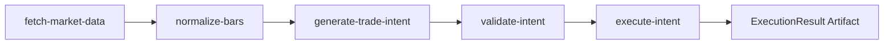

# Agent Trading Toolkit V0 Design

Date: 2026-02-21  
Status: Approved for implementation kickoff  
Owner: thales repo

## Context

This repository is an agent enablement toolkit for cloud-scheduled tasks running on ephemeral VMs. The goal is not to encode one strategy framework up front; the goal is to provide reliable scripts, clients, and contracts that autonomous agents can use to fetch market data, compute trade intents, validate them, and execute through supported providers.

The project is Rust-first for type safety, testability, and contract discipline. Python remains a first-class consumer path for quant analysis and orchestration by invoking Rust CLI commands and exchanging JSON.

## Scope Decisions (Locked)

- Rust-first core implementation, Python allowed as a consumer.
- Real providers in V0: Alpaca + Kraken.
- Integration boundary for non-Rust agents: CLI + JSON contracts.
- Initial command set:
  - `fetch-market-data`
  - `normalize-bars`
  - `generate-trade-intent`
  - `validate-intent`
  - `execute-intent`
- Credentials are loaded from environment variables only.
- Workspace architecture (not single crate; not scripts-only).

## Architecture

The repository uses a Rust workspace with explicit separation between domain contracts, provider adapters, and command execution.

```text
thales/
  crates/
    contracts/
    providers/
      alpaca/
      kraken/
    cli/
  schemas/
  scripts/
  docs/
    runbooks/
    plans/
```

### Crate Responsibilities

- `crates/contracts`
  - Canonical domain models (`Bar`, `BarSeries`, `TradeIntent`, `ExecutionRequest`, `ExecutionResult`)
  - Validation logic and schema version fields
  - Serde codecs and JSON schema export support
- `crates/providers/alpaca`
  - Alpaca-specific transport/auth and mapping to contract types
- `crates/providers/kraken`
  - Kraken-specific transport/auth and mapping to contract types
- `crates/cli`
  - Command binaries/subcommands
  - Input/output wiring (stdin/files -> typed contracts -> JSON output)
  - Exit code policy

### Data Flow



## Command Contracts

Every command:
- Accepts structured JSON input (stdin and/or `--input` file).
- Emits structured JSON output (stdout and/or `--output` file).
- Includes `schema_version` and machine-readable status fields.
- Produces deterministic output for deterministic input where external providers are not involved.

### 1) `fetch-market-data`

- Inputs: provider, symbols, timeframe, window params
- Output: normalized `BarSeries` payload in contract shape
- Notes: provider auth from env vars, no secrets in file inputs

### 2) `normalize-bars`

- Inputs: heterogeneous bar payload
- Output: canonical bars with normalized timestamps/symbol metadata
- Notes: precision and timestamp normalization rules are contract-owned

### 3) `generate-trade-intent`

- Inputs: canonical bars + strategy parameters
- Output: `TradeIntent[]`
- Required fields:
  - `intent_id`
  - `market`
  - `symbol`
  - `side`
  - `size_hint`
  - `confidence`
  - `horizon`
  - `rationale`
  - `invalidation`

### 4) `validate-intent`

- Inputs: one or more `TradeIntent`s
- Output: validation report with pass/fail per intent
- Behavior: non-zero exit when any intent fails validation

### 5) `execute-intent`

- Inputs: valid `TradeIntent` + provider selection
- Output: `ExecutionResult` with provider order identifiers, timestamps, and status
- Behavior: provider adapters map generic contract fields to venue-specific parameters

## Error Model

Errors are explicit and typed. Human-readable text helps operators, but contract JSON is authoritative.

Error classes:
- `ConfigError` (missing env vars, malformed CLI args)
- `InputValidationError` (bad schema/semantic invalidity)
- `ProviderAuthError` (invalid credentials/permissions)
- `ProviderTransientError` (timeouts/throttling/network)
- `ProviderPermanentError` (unsupported symbol/order type, bad params)
- `ExecutionSafetyError` (intent invalidated at execution boundary)

Output envelope pattern:
- `status`: `ok | error`
- `errors`: typed error list
- `warnings`: optional advisory list
- `data`: command-specific payload when successful

## Testing Strategy

Testing follows SPEC-PROOF-RED-GREEN-REFACTOR intent, applied pragmatically for V0:

- `contracts`:
  - serde round-trip tests
  - schema snapshot tests
  - semantic validation tests
- `providers/*`:
  - mapping tests from provider payloads into contract types
  - mocked HTTP tests for auth and failure modes
- `cli`:
  - command contract tests with fixture JSON
  - failure-path tests per error class
- end-to-end:
  - fixture-driven pipeline test for deterministic command chain behavior

Quality expectations:
- no `unwrap()` in production paths
- typed errors (`thiserror`) and explicit non-zero exit codes for failures

## Scheduled Task Operations

This toolkit is built for short-lived cloud scheduler invocations.

Run invariants:
- credentials come from env only
- each task writes predictable artifacts for inspection/audit
- commands are chainable and independent

Artifact convention (initial):

```text
artifacts/
  YYYYMMDD-HHMMSS/
    inputs/
    outputs/
    logs/
```

## Environment Variables (V0)

Provider auth is environment-only.

- Alpaca:
  - `ALPACA_API_KEY`
  - `ALPACA_API_SECRET`
  - `ALPACA_BASE_URL`
- Kraken:
  - `KRAKEN_API_KEY`
  - `KRAKEN_API_SECRET`
  - `KRAKEN_BASE_URL` (optional if defaulted)

## Non-Goals for V0

- Full portfolio/risk platform
- Multi-venue smart order routing
- Rich attribution/performance analytics
- Python bindings (`PyO3`) as primary integration path

## Implementation Kickoff Checklist

- [ ] Create workspace crates and baseline lint/test config
- [ ] Implement contract types + JSON schemas
- [ ] Add provider interface trait and adapter stubs
- [ ] Implement CLI command skeletons with JSON IO envelopes
- [ ] Add fixture-based tests for contracts and CLI commands
- [ ] Add runbooks for scheduler examples (Alpaca + Kraken)

